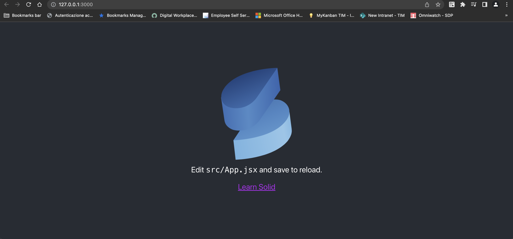

## Create my first app
You can you run your application in 3 different ways:
1. Locally 
```bash
npx degit solidjs/templates/js my-app-01
Need to install the following packages:
  degit
Ok to proceed? (y) y
> cloned solidjs/templates#HEAD to my-app-01
```

```bash
npm install
```
```bash
npm run dev

  VITE v3.0.8  ready in 439 ms

  ➜  Local:   http://127.0.0.1:3000/
  ➜  Network: use --host to expose

```
2. As container

```bash
make run ENV=minikube APP=my-app-01
```

3. Running within your k8s cluster
```bash
make all ENV=minikube APP=my-app-01
```


After that go to the [`url`](http://127.0.0.1:3000/) notified on the ***npm run dev*** command output.



`Solid` comes with 2 main building blocks:
1. `Components` which are functions accepting `props` and returning a [`JSX`](https://reactjs.org/docs/introducing-jsx.html) elements, native `DOM` elements as well as other `Components`.
2. `Reactive Primitives` consist of 3 core ***Primitives***:
  * Signals
  * Memos
  * Effects

  They form a tracking mechanism which enables your view to stay up to date.


## Reactivity
Let's have a look at this first basic example:
### index.html
In this file the main aspect to notify, common across a large variety of framework is setting the [`root div`](./index.html#L12) and the  [`jsx code`](./index.html#L13) code which has to be executed.

```html
<!DOCTYPE html>
<html lang="en">
  <head>
    <meta charset="utf-8" />
    <meta name="viewport" content="width=device-width, initial-scale=1" />
    <meta name="theme-color" content="#000000" />
    <link rel="shortcut icon" type="image/ico" href="/src/assets/favicon.ico" />
    <title>Solid App</title>
  </head>
  <body>
    <noscript>You need to enable JavaScript to run this app.</noscript>
    <div id="root"></div>
    <script src="/src/index.jsx" type="module"></script>
  </body>
</html>
```
### index.jsx
While in this file, responsible for rendering we import the [`solid render function`](./src/index.jsx#L2) which is going to receive a certain component and the element where to attach the component itself (see [`calling the render function`](./src/index.jsx#L7)).

```jsx
/* @refresh reload */
import { render } from 'solid-js/web';

import './index.css';
import App from './App';

render(() => <App />, document.getElementById('root'));
```

### App.jsx
This represents the actual component which we are going to display (in this case the only one, attached to the root element as said above). \
Once we call `createSignal` passing an initial value (zero in this case), it returns a tuple:
* count (i.e. getter)
* setCount (i.e. setter)

This is when the value will start being tracked and via these 2 primitives when can read and update the value so we can reflect the update value within the DOM.

```jsx
import styles from './App.module.css';

import { createSignal, onCleanup } from "solid-js";

function App() {
  const [count, setCount] = createSignal(0),
  timer = setInterval(() => setCount(count() + 1), 500);
  onCleanup(() => clearInterval(timer));

  return <div class={styles.App}>
            <div>
              {count()}
            </div>
          </div>
}

export default App;
```

Signal (i.e. createSignal function) is the most core one. \
It holds a value passed as parameter and `getter` and `setter` function so we can read and intercept changes any time.

```javascript
const [count, setCount] = createSignal(0);
```