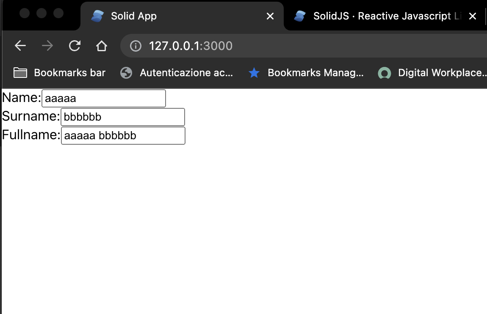

## Let's go a bit further with a second app

You can you run your application in 3 different ways:
1. Locally 
```bash
npx degit solidjs/templates/js my-app-02
Need to install the following packages:
  degit
Ok to proceed? (y) y
> cloned solidjs/templates#HEAD to my-app-02
```

```bash
npm install
```
```bash
npm run dev

  VITE v3.0.8  ready in 439 ms

  ➜  Local:   http://127.0.0.1:3000/
  ➜  Network: use --host to expose

```
2. As container

```bash
make run ENV=minikube APP=my-app-02
```

3. Running within your k8s cluster
```bash
make all ENV=minikube APP=my-app-02
```

In this app we have 3 input element where the third one is bound to the first and second one values.



Having a look at the code we can see that:
```js
import { createSignal, createMemo } from "solid-js";

const App = () => {
  const [ name, setName ] = createSignal('')
  const [ surname, setSurname ] = createSignal('')
  const fullName = createMemo(() => `${name()} ${surname()}`);

  return (
    <div>
      <label for="name">Name:</label>
      <input
        id="name"
        onInput={(e) => setName(e.target.value)}
      />
      <label for="surname">Surname:</label>
      <input 
        id="surname"
        onInput={(e) => setSurname(e.target.value)}
      />
      <label for="fullname">Fullname:</label>
      <input 
        id="fullname" 
        value={fullName()}
      />
    </div>
  )
}

export default App;

```

We call `createSignal` for `name` and `surname` in order we can get our setter and getter for both of them. \
After that we instantiate a Memo (i.e. `createMemo`) and using it to set the `fullname` input value, in essence reacting once either `name` or `surname` value change occurs.
