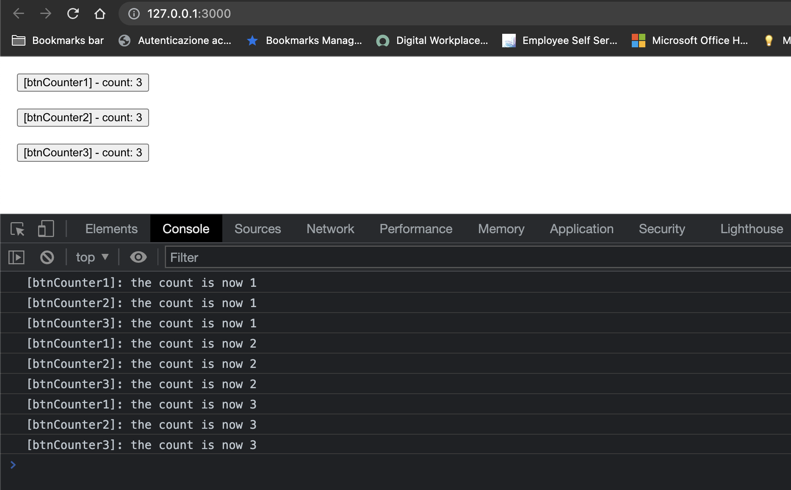

## Looping and `createEffect`

You can you run your application in 3 different ways:
1. Locally 
```bash
npx degit solidjs/templates/js my-app-03
Need to install the following packages:
  degit
Ok to proceed? (y) y
> cloned solidjs/templates#HEAD to my-app-03
```

```bash
npm install
```
```bash
npm run dev

  VITE v3.0.8  ready in 439 ms

  ➜  Local:   http://127.0.0.1:3000/
  ➜  Network: use --host to expose

```
2. As container
```bash
make run ENV=minikube APP=my-app-03
```

3. Running within your k8s cluster
```bash
make all ENV=minikube APP=my-app-03
```

In this app we have 3 buttons. \
Having a look at the code:

These 3 buttons (i.e. `Counter` component) have been instantiated via a `For` component each of them with its own name. \
***App.jsx:*** 
```js
const App = () => {
  const buttons = [
    'btnCounter1', 
    'btnCounter2', 
    'btnCounter3'
  ]
  return (
    <div>
      <For each={ buttons }>{(button, i) =>
        <Counter name={ button } />
      }</For>
    </div>
  )
}
```
Within the `Counter` component we use `createSignal` in order to get the counter's `setter` and `getter` and the `createEffect` function which reacts any time `counter` changes, in essence when we click the button and increment the counter consequently.
```js
function Counter(props) {
  const { name } = props
  const [ count, setCount ] = createSignal(0)
  const increment = () => setCount(count() + 1)
  createEffect(() => { console.log(`[${name}]: the count is now ${count()}`) })
  return (<button 
            style='margin: 20px;display: block;' 
            onClick={ increment }
          >
            [{name}] - count: { count() }
          </button>)
}
```

Notice of course that each button holds its own state:

 
