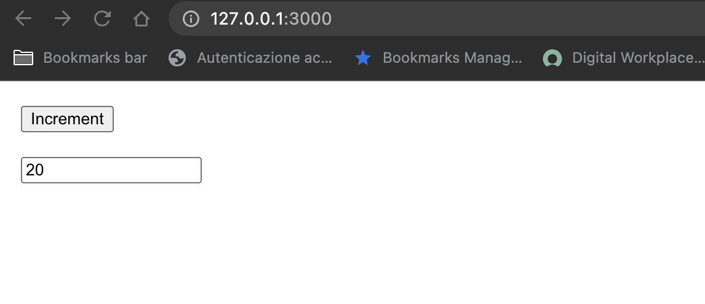

## Derived value

You can you run your application in 3 different ways:
1. Locally 
```bash
npx degit solidjs/templates/js my-app-04
Need to install the following packages:
  degit
Ok to proceed? (y) y
> cloned solidjs/templates#HEAD to my-app-04
```

```bash
npm install
```
```bash
npm run dev

  VITE v3.0.8  ready in 439 ms

  ➜  Local:   http://127.0.0.1:3000/
  ➜  Network: use --host to expose

```
2. As container
```bash
make run ENV=minikube APP=my-app-04
```

3. Running within your k8s cluster
```bash
make all ENV=minikube APP=my-app-04
```

In this app we have [`2 components`](./src/components/) along with the `App` one:
* App
* Input
* Button

***App.jsx:*** 
```js
const App = () => {
  const [ count, setCount ] = createSignal(0)
  const increment = () => { setCount(count() + 1) }
  return (
    <div>
      <Button onClick={ increment }/>
      <Input value={ count }/>
    </div>
  )
}
```

***Button.jsx:*** 
```js
function Button(props) {
  const { onClick } = props
  return (<button 
            style='margin: 20px;display: block;' 
            onClick={ onClick }
          >
            Increment
          </button>)
}
```

***Input.jsx:*** 
```js
function Input(props) {
  const { value } = props
  const derivedSignal = () => value() * 2
  return (<input 
            style='margin: 20px;display: block;' 
            value={ derivedSignal() }
          >
          </input>)
}
```

What we have seen thus far is that we can access the signal and it will
automatically update any view that make use of it when that signal itself changes. Exactly the same thing happens when we have a function that refers to a certain signal, then considering it as derived signal, the component gets its reactivity due to this mechanism.

 
