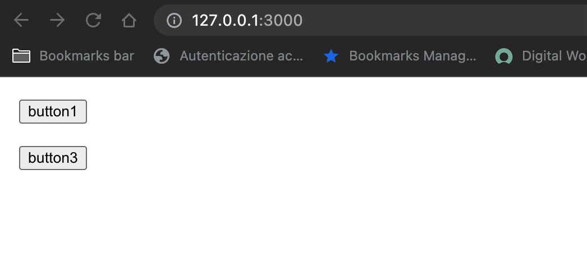

## Flow controls

You can you run your application in 3 different ways:
1. Locally 
```bash
npx degit solidjs/templates/js my-app-05
Need to install the following packages:
  degit
Ok to proceed? (y) y
> cloned solidjs/templates#HEAD to my-app-05
```

```bash
npm install
```
```bash
npm run dev

  VITE v3.0.8  ready in 439 ms

  ➜  Local:   http://127.0.0.1:3000/
  ➜  Network: use --host to expose

```
2. As container
```bash
make run ENV=minikube APP=my-app-05
```

3. Running within your k8s cluster
```bash
make all ENV=minikube APP=my-app-05
```

In this app we have two couple of buttons and they will show alternately according the `show` flag:

***App.jsx:*** 
```js
const App = () => {
  const buttons = [
    { name: "button1" , revert: true },
    { name: "button2" , revert: false },
    { name: "button3" , revert: true },
    { name: "button4" , revert: false },
  ]
  const [ show, setShow ] = createSignal(true)
  setInterval(() => { setShow(!show()) }, 1000)
  return <For each={buttons}>{(button, i) =>
    <Button 
      name={ button.name }
      show={ show }
      revert={ button.revert }
    />
  }
  </For>
}
```

***Button.jsx:*** 
```js
function Button(props) {
  const { 
    name,
    show, 
    revert 
  } = props
  return <Show
            when={ revert ? !show() : show() }
         >
          <button 
            style='margin: 20px;display: block;' 
          >
            { name }
          </button>
         </Show>
}
```

We use the `<Show/>` component in order to handle the flow easily

 
