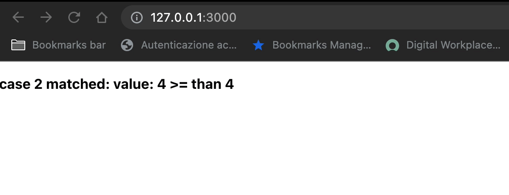

## Flow controls

You can you run your application in 3 different ways:
1. Locally 
```bash
npx degit solidjs/templates/js my-app-06
Need to install the following packages:
  degit
Ok to proceed? (y) y
> cloned solidjs/templates#HEAD to my-app-06
```

```bash
npm install
```
```bash
npm run dev

  VITE v3.0.8  ready in 439 ms

  ➜  Local:   http://127.0.0.1:3000/
  ➜  Network: use --host to expose

```
2. As container
```bash
make run ENV=minikube APP=my-app-06
```

3. Running within your k8s cluster
```bash
make all ENV=minikube APP=my-app-06
```

In this app we show how to deal with conditional part of our DOM in a `switch/case` fashion:

***App.jsx:*** 
```js
const App = () => {
  const [x, setX] = createSignal(0);
  setInterval(() => { setX(Math.floor(Math.random() * 10)) }, 1000)
  const matches = [
    { message: ' >= than 8', condition: 8 },
    { message: ' >= than 6', condition: 6 },
    { message: ' >= than 4', condition: 4 },
    { message: ' >= than 2', condition: 3 },
  ]
  return <Switch 
           fallback={ <p style="color: red; font-weight: bold;">
                        Frankly I dunno what I am supposed to display :-)
                      </p> }
         >
    <For each={matches}>{(match, idx) => {
      return <Match when={x() >= match.condition }>
        <p 
          style="font-weight: bold;"
        >
          case { idx } matched: value: {x()} {match.message}
        </p>  
      </Match>
    }}</For>    
  </Switch>
}  
```


We use the `<Switch>` and `Match` components in order to handle the flow easily. \
Notice that we also used the `fallback` property in case no case have been matched, then handle it. 

 
