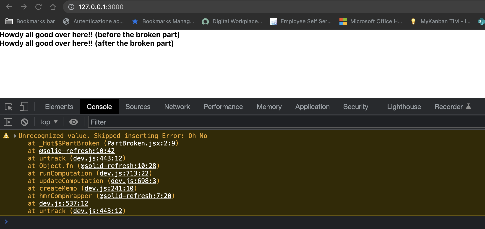

## Flow controls

You can you run your application in 3 different ways:
1. Locally 
```bash
npx degit solidjs/templates/js my-app-07
Need to install the following packages:
  degit
Ok to proceed? (y) y
> cloned solidjs/templates#HEAD to my-app-07
```

```bash
npm install
```
```bash
npm run dev

  VITE v3.0.8  ready in 439 ms

  ➜  Local:   http://127.0.0.1:3000/
  ➜  Network: use --host to expose

```
2. As container
```bash
make run ENV=minikube APP=my-app-07
```

3. Running within your k8s cluster
```bash
make all ENV=minikube APP=my-app-07
```

In this app we have a look at `<ErrorBoundary/>` and how we can handle js error, in essence, preventing from breaking the whole app.

***App.jsx:*** 
```js
import { ErrorBoundary } from "solid-js";
import  PartFine from "./PartFine";
import  PartBroken from "./PartBroken";

const App = () => {
  return <div>    
      <PartFine message="Howdy all good over here!! (before the broken part)"/>
      <ErrorBoundary fallback={err => err}>
        <PartBroken/>
      </ErrorBoundary>
      <PartFine message="Howdy all good over here!! (after the broken part)"/>
  </div>
}
export default App;
}  
```

***PartBroken.jsx:*** 
```js
const PartBroken = (props) => {
  throw new Error("Oh No");
  return <div>we will never reach this point</div>
}
export default PartBroken
```

***PartFine.jsx:*** 
```js
const PartFine = props => {
  const { message } = props
  return <div><b>{ message }</b></div>
}
export default PartFine
```

 
