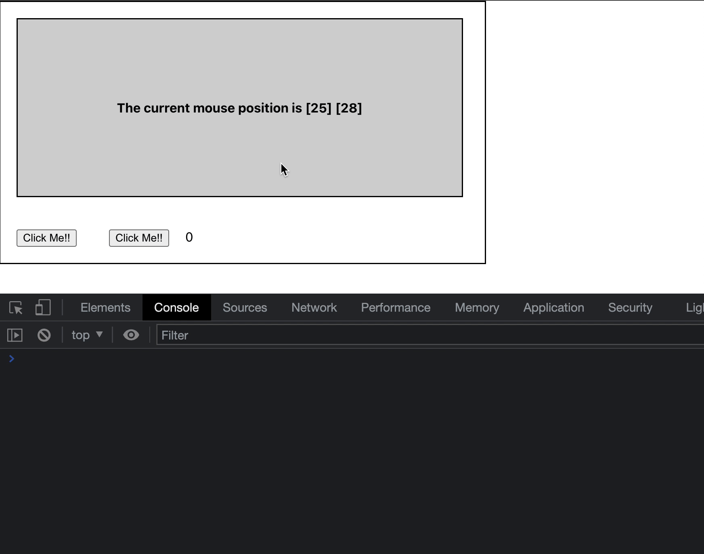

## Event binding

You can you run your application in 3 different ways:
1. Locally 
```bash
npx degit solidjs/templates/js my-app-09
Need to install the following packages:
  degit
Ok to proceed? (y) y
> cloned solidjs/templates#HEAD to my-app-09
```

```bash
npm install
```
```bash
npm run dev

  VITE v3.0.8  ready in 439 ms

  ➜  Local:   http://127.0.0.1:3000/
  ➜  Network: use --host to expose

```
2. As container
```bash
make run ENV=minikube APP=my-app-09
```

3. Running within your k8s cluster
```bash
make all ENV=minikube APP=my-app-09
```

In Solid events are attributes with `on` as prefix. In order to improve performance, array syntax is supported too like in the example implemented for the first button.

```js
const handlerFunction = (data, event) => /* some code goes here */
<button onClick={[handlerFunction, data]}>Howdy might you click me :-)</button>
```

***App.jsx:*** 
```js
import { createSignal } from "solid-js";
import "./styles.css";

function App() {
  const [pos, setPos] = createSignal({x: 0, y: 0});
  const [n, setN] = createSignal(0);

  const getX = coords => coords()?.x
  const getY = coords => coords()?.y
  const handleMouseMove = event => { setPos({ x: event.clientX, y: event.clientY }) }

  const onCLickBtn1 = (data, event) => { 
    console.log('event:', event)
    setN(data() + 1) 
  }
  const onCLickBtn2 = () => { setN(n() + 1) }

  return <div class="container">
      <div class="rectangle element"
        onMouseMove={ handleMouseMove }
      >
        The current mouse position is [{ getX(pos) }] [{ getY(pos) }]
      </div>
      <div>
      <button class="button element" onClick={ [onCLickBtn1, n] }>Click Me!!</button>
      <button class="button element" onClick={ onCLickBtn2 }>Click Me!!</button>
      <span>{ n()}</span>
      </div>
    </div>
}
export default App;
```

 
