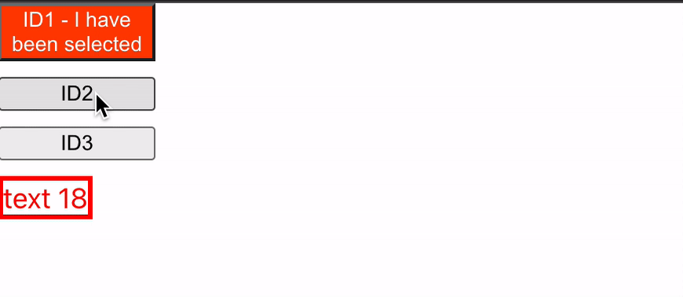

## Style in SolidJs

You can you run your application in 3 different ways:
1. Locally 
```bash
npx degit solidjs/templates/js my-app-10
Need to install the following packages:
  degit
Ok to proceed? (y) y
> cloned solidjs/templates#HEAD to my-app-10
```

```bash
npm install
```
```bash
npm run dev

  VITE v3.0.8  ready in 439 ms

  ➜  Local:   http://127.0.0.1:3000/
  ➜  Network: use --host to expose

```
2. As container
```bash
make run ENV=minikube APP=my-app-10
```

3. Running within your k8s cluster
```bash
make all ENV=minikube APP=my-app-10
```

In SolidJs we can declare own style attribute as either style strings or objects like in the second example below:
```js
    <div 
      style={{'border': `solid ${getColor(n)} 3px`,
        'color': getColor(n),
        'width': 'fit-content',
        'font-size': `${n()}px`,
      'text-transform': getTextCase(n)}}
    >Text {n()}</div>
```
Otherwise we can use the `class` to set className on a certain element like for the first example (i.e. buttons).


***App.jsx:*** 
```js
import { createSignal } from "solid-js";
import "./styles.css";

const getTextCase = (n) => (n() % 2) ? 'uppercase' : 'lowercase'
const getColor = (n) => (n() % 2) ? 'black' : 'red'
const getNumber = (from, to) => Math.floor(Math.random() * from) + to

function App() {
  const [n, setN] = createSignal(20);
  const [leader, setLeader] = createSignal("")
  setInterval(() => setN(getNumber(50, 15)), 1000)
  return <>
    <button 
      onClick={() => setLeader('ID1')}
      class={leader() === 'ID1' ? 'selected' : ''}
    >
      ID1{leader() === 'ID1' ? ' - I have been selected' : ''}
    </button>
    <button 
      onClick={() => setLeader('ID2')}
      class={leader() === 'ID2' ? 'selected' : ''}
    >
      ID2{leader() === 'ID2' ? ' - I have been selected' : ''}
    </button>
    <button 
      onClick={() => setLeader('ID3')}
      class={leader() === 'ID3' ? 'selected' : ''}
    >
      ID3{leader() === 'ID3' ? ' - I have been selected' : ''}
    </button>

    <div 
      style={{'border': `solid ${getColor(n)} 3px`,
        'color': getColor(n),
        'width': 'fit-content',
        'font-size': `${n()}px`,
      'text-transform': getTextCase(n)}}
    >Text {n()}</div>
  </>
}
export default App;
```

 
