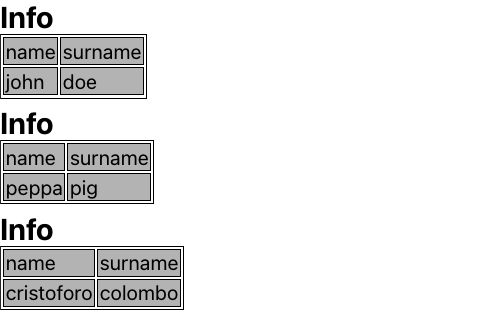

## Binding - Spreads

You can you run your application in 3 different ways:
1. Locally 
```bash
npx degit solidjs/templates/js my-app-11
Need to install the following packages:
  degit
Ok to proceed? (y) y
> cloned solidjs/templates#HEAD to my-app-11
```

```bash
npm install
```
```bash
npm run dev

  VITE v3.0.8  ready in 439 ms

  ➜  Local:   http://127.0.0.1:3000/
  ➜  Network: use --host to expose

```
2. As container
```bash
make run ENV=minikube APP=my-app-11
```

3. Running within your k8s cluster
```bash
make all ENV=minikube APP=my-app-11
```


As syntax sugar in case your component accepts a variable number of attributes we can put all of them into an Object and passing to the component itself via `spread operator`.

```js
<Info {...info}></Info>
```

***App.jsx:*** 
```js
import { For } from "solid-js";
import Info from "./Info";
import "./styles.css";

function App() {
  const infos = [
    { name: "john", surname: "doe"},
    { name: "peppa", surname: "pig"},
    { name: "cristoforo", surname: "colombo"},
  ]
  return <For each={infos}>{(info) => <Info {...info}></Info> }</For>
}
export default App;

```

***Info.jsx:*** 
```js
import { For } from "solid-js";

const Info = (props) => {
  const { name, surname } = props
  const tableHeader = <tr><For each={Object.keys(props)}>{(col) => <td>{ col }</td> }</For></tr>
  return <>
    <h2>Info</h2>
    <table>
      <tbody>
        { tableHeader }
        <tr>
          <td>{ name }</td>
          <td>{ surname }</td>
        </tr>
      </tbody>
    </table>
  </>
}

export default Info
```

 
