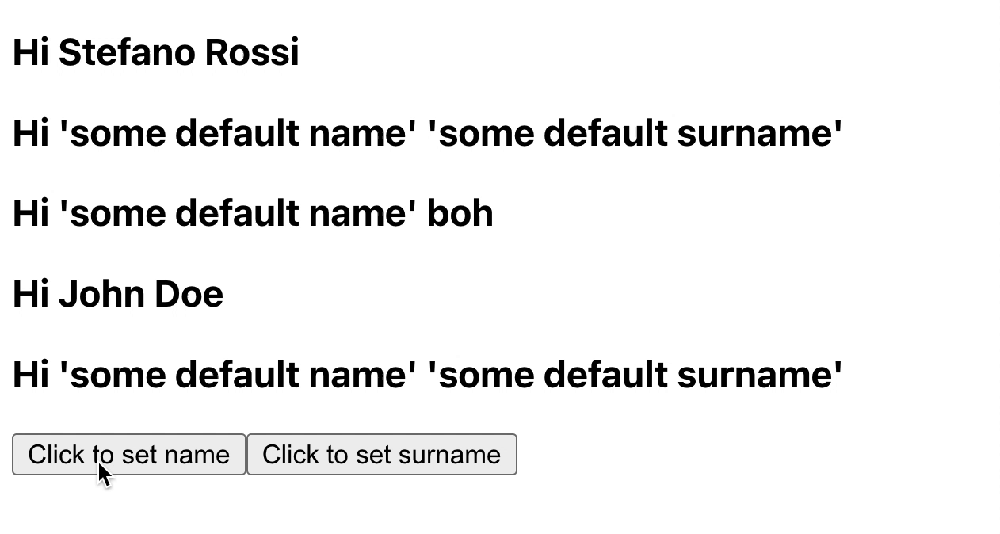

## Merging Props

You can you run your application in 3 different ways:
1. Locally 
```bash
npx degit solidjs/templates/js my-app-12
Need to install the following packages:
  degit
Ok to proceed? (y) y
> cloned solidjs/templates#HEAD to my-app-12
```

```bash
npm install
```
```bash
npm run dev

  VITE v3.0.8  ready in 439 ms

  ➜  Local:   http://127.0.0.1:3000/
  ➜  Network: use --host to expose

```
2. As container
```bash
make run ENV=minikube APP=my-app-12
```

3. Running within your k8s cluster
```bash
make all ENV=minikube APP=my-app-12
```

In SolidJS `props` is the object containing all the properties we pass to a certain component (i.e. component function):
```js
<SampleComponent 
  prop1="prop1 value"
  prop2="prop2 value"
  prop3="prop3 value"
/>
```

```js
const SampleComponent = props => {
  console.log(props)
}
```
***Console output:***
```js
Object {prop1="prop1 value" prop2="prop2 value" prop3="prop3 value"}
```
`mergeProps` is a SolidJs function able to merge potential reactive object together so you can prevent from losing reactivity.

***MergingComponent.jsx:*** 
```js
import { mergeProps } from "solid-js";

const MergingComponent = (props) => {
  const merged = mergeProps({ 
    name: "'some default name'", 
    surname: "'some default surname'" }, 
  props)
  return <h3>Hi {merged.name} {merged.surname}</h3>
}
export default MergingComponent
```
***App.jsx:*** 
```js
import { createSignal } from "solid-js";
import MergingComponent from "./MergingComponent";
import "./styles.css";

const App = () => {
  const [name, setName] = createSignal();
  const [surname, setSurname] = createSignal();

  return <div class="container">
    <MergingComponent name="Stefano" surname="Rossi"/>
    <MergingComponent/>
    <MergingComponent surname="boh"/>
    <MergingComponent name="John" surname="Doe"/>
    <MergingComponent name={name()} surname={surname()}/>
    <button 
      onClick={() => setName("Mario")}>
      Click to set name
    </button>
    <button 
      onClick={() => setSurname("Bianchi")}>
      Click to set surname
    </button>
  </div>
}
export default App
```

 
