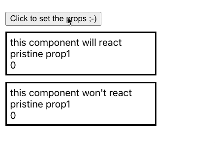

## Splitting Props

You can you run your application in 3 different ways:
1. Locally 
```bash
npx degit solidjs/templates/js my-app-13
Need to install the following packages:
  degit
Ok to proceed? (y) y
> cloned solidjs/templates#HEAD to my-app-13
```

```bash
npm install
```
```bash
npm run dev

  VITE v3.0.8  ready in 439 ms

  ➜  Local:   http://127.0.0.1:3000/
  ➜  Network: use --host to expose

```
2. As container
```bash
make run ENV=minikube APP=my-app-13
```

3. Running within your k8s cluster
```bash
make all ENV=minikube APP=my-app-13
```

SolidJS has the `splitProps` function so we can split properties which the component receives in order, for example, we can use some of them on the component itself and pass the remaining through to and hypothetical child components, this can be a typical scenario for instance. \
Using `splitProps` is also essential to not lose reactivity like for the `<ThisWontReact/>` component.

***Loosing reactivity:***
```js
const { disclaimer, prop1, counter, ...others } = props
```
***Keeping reactivity:***
```js
const [local, others] = splitProps(props, ['disclaimer', 'prop1', 'counter'])
```

***App.jsx:*** 
```js
import { createSignal } from "solid-js";
import ThisWillReact from "./ThisWillReact";
import ThisWontReact from "./ThisWontReact";
import "./styles.css";

function App() {
  const [ n, setN ] = createSignal(0)
  const [ prop1, setProp1 ] = createSignal('pristine prop1')

  return <div class="app-container">
    <button onCLick={() => { setProp1('prop1 has been set :-)'); setN(n()+1); }}>Click to set the props ;-)</button>
    <ThisWillReact 
      disclaimer="this component will react" 
      prop1={prop1()}
      counter={n()}
      />
    <ThisWontReact 
      disclaimer="this component won't react" 
      prop1={prop1()}
      counter={n()}
    />
  </div>
}
export default App;
```

***ThisWillReact.jsx:*** 
```js
import { splitProps } from "solid-js";

const ThisWillReact = (props) => {
  const [local, others] = splitProps(props, ['disclaimer', 'prop1', 'counter'])
  return <div class="container">
    <div>{ local.disclaimer }</div>
    <div>{ local.prop1 }</div>
    <div>{ local.counter }</div>
  </div>
}

export default ThisWillReact
```
***ThisWontReact.jsx:*** 
```js
const ThisWontReact = (props) => {
  const { disclaimer, prop1, counter, ...others } = props
  return <div class="container">
    <div>{ disclaimer }</div>
    <div>{ prop1 }</div>
    <div>{ counter }</div>
  </div>
}

export default ThisWontReact
```

 
