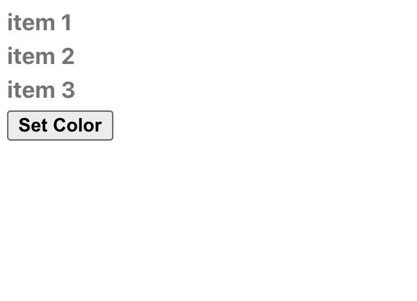

## Children Props

You can you run your application in 3 different ways:
1. Locally 
```bash
npx degit solidjs/templates/js my-app-14
Need to install the following packages:
  degit
Ok to proceed? (y) y
> cloned solidjs/templates#HEAD to my-app-14
```

```bash
npm install
```
```bash
npm run dev

  VITE v3.0.8  ready in 439 ms

  ➜  Local:   http://127.0.0.1:3000/
  ➜  Network: use --host to expose

```
2. As container
```bash
make run ENV=minikube APP=my-app-14
```

3. Running within your k8s cluster
```bash
make all ENV=minikube APP=my-app-14
```

In `SolidJS` props ara lazily evaluated meaning that their access happen just when we access to them.
Therefore they keep their reactivity without having the need of continuous synchronization. \
A frequent access to them can lead our app to repeatedly creating components, especially when we talk about children component, when instead, most of the time we need just to insert some property inside the components. \
For this reason `children` helper which provides two capabilities:
* Creates a [`memo`](https://www.solidjs.com/docs/latest/api#creatememo) around the children props
* Resolves every child component reactivity reference

The outcome is that we can interact directly with our children components preventing from having the behavior mentioned above.

***App.jsx:*** 
```js
import { createSignal } from "solid-js";
import ItemList from "./ItemList";

import './styles.css'

const randomColor = () => `#${Math.floor(Math.random()*16777215).toString(16)}`

const App = () => {
  const [color, setColor] = createSignal("grey");

  return <div class="app-container">
    <ItemList color={color()}>
      <For each={["item 1", "item 2", "item 3"]}>{ item => <div class="item">{item}</div> }</For>
    </ItemList>
    <button 
      onClick={() => setColor(randomColor())}
    >
      Set Color
    </button>
  </div>
}
export default App;

```

***ItemList.jsx:*** 
```js
import { createEffect, children } from "solid-js";

const ItemList = props => {
  const c = children(() => props.children)
  createEffect(() => c().forEach(item => item.style.color = props.color))
  return <>{c()}</>
}
export default ItemList
```

 
