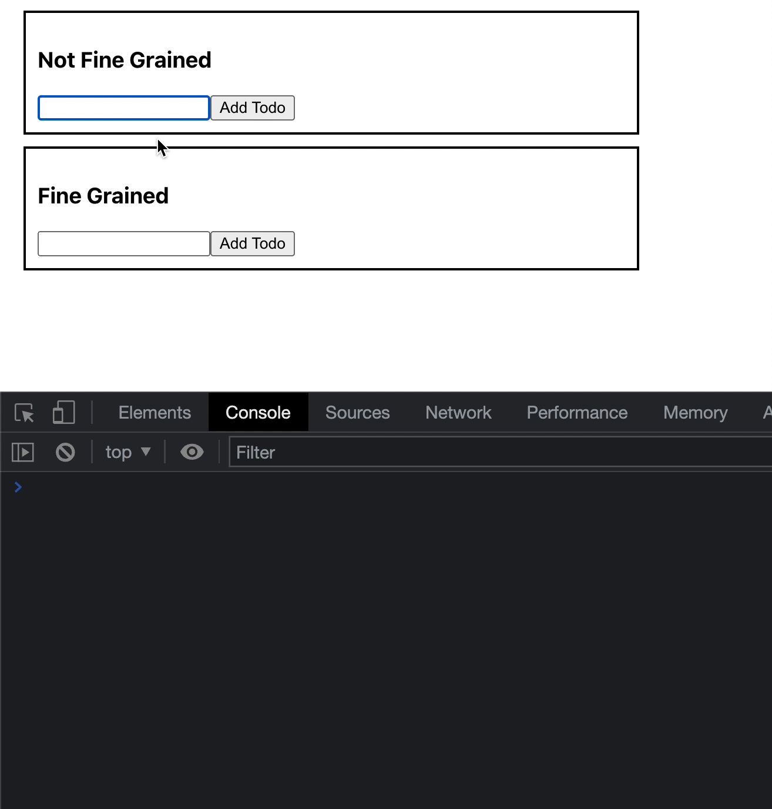

## Nested Reactivity

You can you run your application in 3 different ways:
1. Locally 
```bash
npx degit solidjs/templates/js my-app-15
Need to install the following packages:
  degit
Ok to proceed? (y) y
> cloned solidjs/templates#HEAD to my-app-15
```

```bash
npm install
```
```bash
npm run dev

  VITE v3.0.8  ready in 439 ms

  ➜  Local:   http://127.0.0.1:3000/
  ➜  Network: use --host to expose

```
2. As container
```bash
make run ENV=minikube APP=my-app-15
```

3. Running within your k8s cluster
```bash
make all ENV=minikube APP=my-app-15
```

In this chapter I reimplemented the example within the `SolidJS` tutorial in order to test nested reactivity having 2 distinct component having different behavior as shown in the animated image.
The key part below:

```js
const [todos, setTodos] = createSignal([])
const addTodo = (text) => {
  const [completed, setCompleted] = createSignal(false)
  setTodos([...todos(), { id: ++todoId, text, completed, setCompleted }])
};
const toggleTodo = (id) => {
  const todo = todos().find((t) => t.id === id)
  if (todo) todo.setCompleted(!todo.completed())
}
```

***App.jsx:*** 
```js
import ToDoNotFineGrained from "./ToDoNotFineGrained";
import ToDoFineGrained from "./ToDoFineGrained";
import './styles.css'

const App = () => {
  return <div class="app-container">
    <ToDoNotFineGrained title="Not Fine Grained"/>
    <ToDoFineGrained title="Fine Grained"/>
  </div>
}
export default App;

```

***ToDoNotFineGrained.jsx:*** 
```js
import { For, createSignal } from "solid-js";

const ToDoNotFineGrained = props => {
  let input
  let todoId = 0
  const [todos, setTodos] = createSignal([])

  const addTodo = (text) => {
    setTodos([...todos(), { id: ++todoId, text, completed: false }])
  }
  const toggleTodo = (id) => {
    setTodos(todos().map((todo) => (
      todo.id !== id ? todo : { ...todo, completed: !todo.completed }
    )));
  }

  return (
    <div class="todo">
      <div>
        <h3>{ props.title }</h3>
        <input ref={input} />
        <button
          onClick={(e) => {
            if (!input.value.trim()) return;
            addTodo(input.value)
            input.value = ''
          }}
        >
          Add Todo
        </button>
      </div>
      <For each={todos()}>
        {(todo) => {
          const { id, text } = todo;
          console.log(`Creating ${text}`)
          return <div>
            <input
              type="checkbox"
              checked={todo.completed}
              onchange={[toggleTodo, id]}
            />
            <span
              class={ todo.completed ? "completed" : "not-completed"}
            >{text}</span>
          </div>
        }}
      </For>
    </div>
  );
}
export default ToDoNotFineGrained
```

***ToDoFineGrained.jsx:*** 
```js
import { For, createSignal } from "solid-js";

const ToDoFineGrained = props => {
  let input
  let todoId = 0
  const [todos, setTodos] = createSignal([])
  const addTodo = (text) => {
    const [completed, setCompleted] = createSignal(false)
    setTodos([...todos(), { id: ++todoId, text, completed, setCompleted }])
  };
  const toggleTodo = (id) => {
    const todo = todos().find((t) => t.id === id)
    if (todo) todo.setCompleted(!todo.completed())
  }

  return (
    <div class="todo">
      <div>
        <h3>{ props.title }</h3>
        <input ref={input} />
        <button
          onClick={(e) => {
            if (!input.value.trim()) return
            addTodo(input.value)
            input.value = ''
          }}
        >
          Add Todo
        </button>
      </div>
      <For each={todos()}>
        {(todo) => {
          const { id, text } = todo;
          console.log(`Creating ${text}`)
          return <div>
            <input
              type="checkbox"
              checked={todo.completed()}
              onchange={[toggleTodo, id]}
            />
            <span
              class={ todo.completed() ? "completed" : "not-completed"}
            >{text}</span>
          </div>
        }}
      </For>
    </div>
  );
}
export default ToDoFineGrained
```


 
