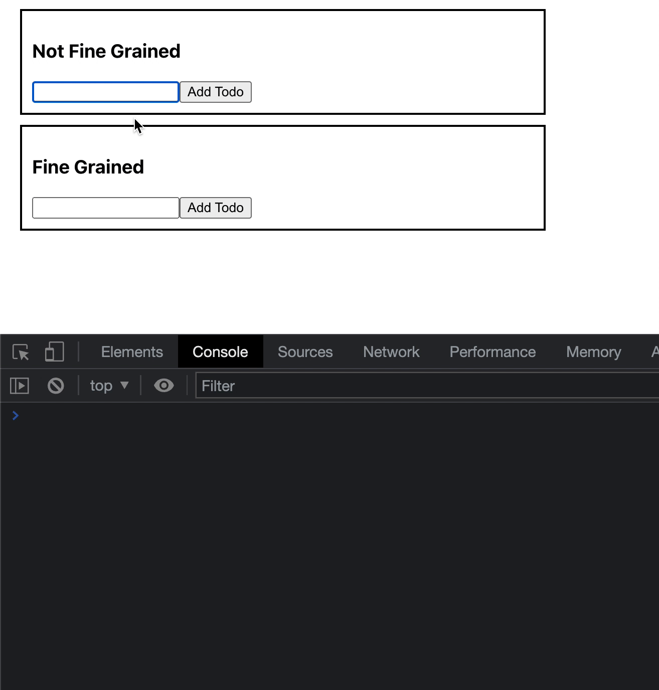

## Store

You can you run your application in 3 different ways:
1. Locally 
```bash
npx degit solidjs/templates/js my-app-16
Need to install the following packages:
  degit
Ok to proceed? (y) y
> cloned solidjs/templates#HEAD to my-app-16
```

```bash
npm install
```
```bash
npm run dev

  VITE v3.0.8  ready in 439 ms

  ➜  Local:   http://127.0.0.1:3000/
  ➜  Network: use --host to expose

```
2. As container
```bash
make run ENV=minikube APP=my-app-16
```

3. Running within your k8s cluster
```bash
make all ENV=minikube APP=my-app-16
```

Temporary to fill with the related description
```js

```


<!--   -->
